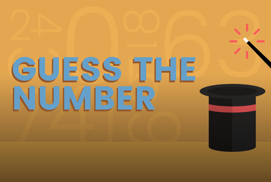

# Python 🐍

## 1. O Jogo

    
    _Guess the number_ é um jogo interativo que ocorre no terminal, onde o jogador
    e o computador se revezam tentando adivinhar um número aleatório entre 1 e 100.
    Eles devem levar em consideração a tentativa anterior, se foi "muito alta" ou
    "muito baixa".

### 1.1 Como iniciar o jogo?
  - Abra o código no seu terminal e rode o seguinte código:
    

### 1.2 Simulação do jogo: 
  
  - Mensagem de boas-vendas . Digite seu nome para o jogo saber quem está jogando , e chamá-lo pelo nome.
  

  - O terminal iniciará o jogo solicitando um palpite, e mostrará uma mensagem para indicar se o palpite foi maior, menor ou igual ao número sorteado.
  

  - Caso não seja o número correto, será a vez do jogador computador palpitar. O mesmo ocorre com a mensagem retornada.
  

  - Para fazer o palpite, é necessário colocar um número entre 1 e 100. Caso contrário, aparecerá uma mensagem de erro e o jogo só continuará assim que a condição for preenchida.  
  

  - Caso o palpite seja correto, o terminal retorna com uma frase de parabéns e mostra todos os palpites que
  o vencedor fez durante o jogo.
  

  - Existe a opção de jogar novamente ou não. Para iniciar um novo jogo, tecle "s", caso contrário, tecle "n".
  

## 2. Considerações Gerais

- Jogo implementado em Python. A única dependência externa que foi
  utilizadas é o pytest para testes unitários.
- O jogo será realizado no terminal. Os testes podem ser executados no terminal
  ou em seu IDE (VSCode é mais do que adequado).
- Será utilizado um número aleatório entre 1 e 100 como número secreto.
- O jogador e o computador se revezarão para adivinhar o número.
- Após cada turno, serão mostradas informações sobre a suposição feita.
- O jogo terminará quando o número for adivinhado. Será mostrada uma lista de
  todas as tentativas do jogador vencedor.

## 3. Considerações Técnicas

O jogo será realizado no terminal usando Python. A lógica do jogo é baseada
em estruturas de controle, incluindo loops, condicionais e coleções. Utilizei uma funcionalidade da biblioteca de utilidades do Python para a
geração de números aleatórios. Foi realizado testes unitários para suas
classes e métodos utilizando PyTest e simulação de geração de números
aleatórios com unittest.mock.

## 4. Futuras implementações e melhorias:

### 4.1 Criar uma "inteligência" para jogar contra o computador (Edição Hacker)

Depois de ter implementado o jogo básico e feito algumas melhorias, você pode
levar as coisas para o próximo nível criando uma "inteligência" para jogar
contra o computador. Esta "inteligência" poderia ser simplesmente outra
implementação do jogo que usa uma estratégia diferente, ou poderia ser um
algoritmo de aprendizado de máquina que melhora a cada jogo que joga.

1. Implemente uma nova versão do jogo que usa uma estratégia diferente. Por
exemplo, em vez de adivinhar aleatoriamente, esta versão poderia tentar
adivinhar o número mais provável com base nas suposições anteriores.

2. Teste sua nova "inteligência" jogando contra o computador. Você pode vencer
o computador com sua nova estratégia?

3. Se você se sentir ambicioso, você pode tentar implementar um algoritmo de
aprendizado de máquina. Este algoritmo poderia aprender de cada jogo que joga,
melhorando suas suposições a cada jogo. Você poderia usar uma biblioteca de
aprendizado de máquina como scikit-learn para fazer isso.

4. Certifique-se de adicionar testes unitários para sua nova "inteligência".
Você também pode querer adicionar algumas métricas para rastrear como seu
algoritmo melhora a cada jogo que joga.

#### Referências

- [Introdução ao
  scikit-learn](https://scikit-learn.org/stable/getting_started.html)
- [Como implementar um algoritmo de aprendizado de
  máquina](https://machinelearningmastery.com/start-here/#algorithms)

### 4.2 Extensão: Versão Orientada a Objetos (OOP)

Uma vez que tenhas implementado e aprimorado a versão base do jogo,
pode ser interessante considerar a possibilidade de reescrevê-lo
utilizando o paradigma da Programação Orientada a Objetos (OOP).
Essa seria uma extensão (e não um requisito) que te permitiria
familiarizar-se com os objetivos de aprendizado da programação
orientada a objetos. Talvez seja útil se os teus próximos projetos
em Python envolverem codificação com frameworks que utilizam esse
paradigma. Por exemplo, algumas ferramentas como os
ORM (Mapeadores Objeto-Relacional) encontrados no mundo do Python
são projetados para funcionar com programação orientada a objetos.

1. Crie uma classe `Game` que represente uma instância do jogo. Esta classe
pode ter métodos como `start`, `play_turn`, `check_guess`, e `end_game`.

2. Crie uma classe `Player` que represente um jogador. Esta classe pode ter
atributos como `name` e `guesses`, e métodos como `make_guess`.

3. Crie uma subclasse `ComputerPlayer` que herde da classe `Player`. Esta
classe pode sobrescrever o método `make_guess` para implementar a lógica de
adivinhação do computador.

4. Na classe `Game`, use instâncias das classes `Player` e `ComputerPlayer`
para representar o jogador e o computador.

5. Adicione testes unitários para suas classes e métodos. Python tem um módulo
incorporado chamado `unittest` que você pode usar para isso.

### Referências

- [Programação Orientada a Objetos em
  Python](https://docs.python.org/3/tutorial/classes.html)
